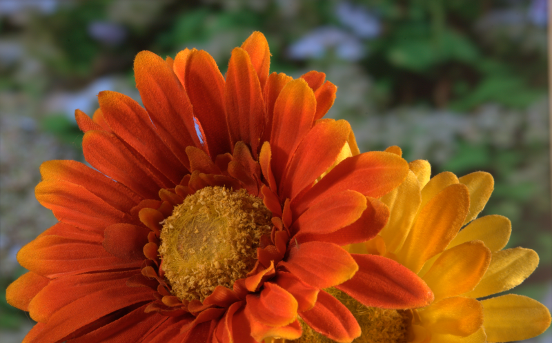
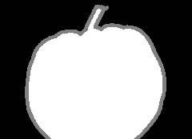

<!-- ## Probability and Random Processes - Assignment 3 -->

### Bayesian Matting
###### Praveen Venkatesh

### Results

Here are some results of the algorithm on a few images. The output can be tweaked by setting the various parameters of the algorithm appropriately. The SAD is computed from the opacity values as the difference between absolute sum of difference per pixel between GT and the prediction. 
Original | Trimap | Estimated   |  Ground Truth | SAD 
:---:|:---:|:---------:|:--------:|:---:
 | | |   | 1719.04 (397000 unknowns)
 | | |   | 329.73 (15486 unknowns)
 | | |   | 147.46 (7896 unknowns)
 | | |   | 320.87 (15027 unknowns)
 | | |   | 262.72 (14301 unknowns)
 | | |   | 177.76 (9081 unknowns)
 | | |   | 214.80 (10014 unknowns)
 | | |   | 267.00 (6864 unknowns)

$$
    L(C \mid F, B, \alpha)=-\|C-\alpha F-(1-\alpha) B\|^{2} / \sigma_{C}^{2}
$$

### Implementation - Explanation

Here, we use a Bayesian Framework in order to achieve the problem of Natural Image Matting. The Image matting equation says that the observed colour is a linear combination of the foreground and background colors, weighted by a and 1 - a respectively, where a is a opacity matte that is unique for each pixel in the image. Here, we utilize a Bayesian Framework in order to find the best values of a for each pixel. Here is an explanation of the algorithm. We are given an input image as well as a trimap that indicates regions which belong surely to the background, surely to the foreground, and a gray area that we need to determine the values of opacity for:
<!-- 
- We know the observed colour as the pixel value in the image. Let us denote this pixel as $C$. We don't know the colour of the foreground, or the background, and hence need to estimate these by using a window around the area of interest. We can represent this mathematically as maximizing the probability of particular values of $F, B$ and  $\alpha$ given the observed colour $C$ as $\arg \max _{F, B, \alpha} P(F, B, \alpha \mid C)$. We need to find the values of $F, B$ and $\alpha$ for all pixels that are marked unknown in the trimap.

- Using the Bayes theorem and assuming that the foreground pixels and the background pixels are independent, we can rewrite this as:
$$
\arg \max _{F, B, \alpha} P(F, B, \alpha \mid C)
=\arg \max _{F, B, \alpha} P(C \mid F, B, \alpha) \cdot P(F) \cdot P(B) \cdot P(\alpha) / P(C) 
$$

- Since a product is more expensive to compute than addition, and there are several other operations that may involve exponentiation down the lane, we shall convert this into logarithmic scale. Let us represent $\log P \sim L$. This gives:
$$ \arg \max _{F, B, \alpha} L(C \mid F, B, \alpha)+L(F)+L(B)+L(\alpha)$$

- Let us now define the above terms in the equation:
    - In this method, the term $L(\alpha)$ is assumed to be a constant, and is eliminated from the maximization equation.
    - Since the term $L(C \mid F, B, \alpha)$ gives a likelihood of $C$ given the values $F, B$ and $\alpha$, we can say that a Gaussian distribution centred at the observed colour can model the likelihood. We can hence represent this term as:
    $$
    L(C \mid F, B, \alpha)=-\|C-\alpha F-(1-\alpha) B\|^{2} / \sigma_{C}^{2}
    $$
    where $\sigma_{C}^{2}$ is the variance in the image.
    - We use data near the region of interest to estimate the terms $L(F)$ and $L(B)$. First, we take a small window of interest near the pixel marked unknown. Let the window size be $N\times N\times 3$ (3 for the 3 channel image BGR). Now, in order to more accurately model the distribution, let us weight the contributions of the pixels before proceeding with the math. The weights can be determined by defining a Gaussian kernel multiplied with the pixel opacity squared. i.e., $w_i = \alpha ^2 _i g_i \forall i \in \text{window} $. For the background, we can use a weighting window defined by $w_i = (1 - \alpha _i) ^2  g_i \forall i \in \text{window} $. The Guassian kernel helps emphasize colours that are closer to the unknown region than those that are farther away since the colours closer will represent a better estimate of the actual foreground or background due to the continuous nature of the image (excluding noise).
    - Once we get the weighting window, we now cluster the entire window into some $n$ clusters. In my implementation, I have used the KMeans clustering algorithm with $n = 5$.
    - We will be fitting the foreground and background into a Gaussian distribution, we will need both the covariance and the means of these clusters.
    - With these $n$ clusters, we find the weighted mean colour of each cluster (using the weights we found earlier).
    $$\bar{F}=\frac{1}{W} \sum_{i \in N} w_{i} F_{i}$$

    - Now, we find the weighted covariance between the BGR channels of the particular cluster. This will help establish the dependence of each of the 3 channels with each other.
    $$ \Sigma_{F}=\frac{1}{W} \sum_{i \in N} w_{i}\left(F_{i}-\bar{F}\right)\left(F_{i}-\bar{F}\right)^{T} $$

    - Now that we have the mean and covariances, let us fit a Gaussian distribution onto our foreground. We can hence represent the likelihood of the foreground of a particular cluster as:
    $$L(F)=-(F-\bar{F})^{T} \Sigma_{F}^{-1}(F-\bar{F}) / 2$$

    - By repeating a similar case for the background, we can find the value of $L(B)$ as well.

- Now that we have all the terms in the maximization equation, we take the derivative of the equation with respect to $F$ and $B$ and set them to zero, assuming that $\alpha$ is constant. By doing this, we get an equation: 
$$
\begin{array}{c}
{\left[\begin{array}{cc}
\Sigma_{F}^{-1}+I \alpha^{2} / \sigma_{C}^{2} & I \alpha(1-\alpha) / \sigma_{C}^{2} \\
I \alpha(1-\alpha) / \sigma_{C}^{2} & \Sigma_{B}^{-1}+I(1-\alpha)^{2} / \sigma_{C}^{2}
\end{array}\right]\left[\begin{array}{c}
F \\
B
\end{array}\right]} 
=\left[\begin{array}{c}
\Sigma_{F}^{-1} \bar{F}+C \alpha / \sigma_{C}^{2} \\
\Sigma_{B}^{-1} \bar{B}+C(1-\alpha) / \sigma_{C}^{2}
\end{array}\right]
\end{array}
$$

- This can be solved very easily since all of the values are known except alpha!

- After obtaining the values of $F$ and $B$, we substitute the constant value of $F$ and $B$ in the maximization equation and arrive at a closed form solution for the opacity as:
$$
\alpha=\frac{(C-B) \cdot(F-B)}{\|F-B\|^{2}}
$$

- We are left with two equations that can now be iteratively solved in order to reach a good solution that maximizes the likelihood equation.

- Since there were several clusters that we found previously, and we solved for only one cluster, we iterate through pairs of the foreground and background clusters to see which ordered pair gives the maximum likelihood for the probability. -->

### Notes on Implementation

- When computing the covariance matrix, a small term is added to the diagonals in order to prevent divide by zero errors and issues with singular matrices.

- There is a defined threshold for the amount of data required to solve for a particular pixel. Sometimes, there is not enough data provided to the solver to cross the threshold and hence it goes into an infinite loop. To solve this, the window size is increased when the solver refuses to solve.

- The images have been scaled down to 30% of their size in order to speed up computation. This is purely because of computational constraints as it takes too long to solve for the images.

### References

[1] Yung-Yu Chuang, Brian Curless, David H. Salesin, and Richard Szeliski. A Bayesian Approach to Digital Matting. In _Proceedings of IEEE Computer Vision and Pattern Recognition (CVPR 2001)_, Vol. II, 264-271, December 2001

[2] Forte Marco, bayesian matting, (2018), GitHub repository, https://github.com/MarcoForte/bayesian-matting

[3] Wakankar Anushka, Poisson Matting, (2019), GitHub repository https://github.com/anushkawakankar/Poisson-Matting

[4]"贝叶斯估计、最大似然估计、最大后验概率与Baysian Matting - EpsAvlc的博客", Epsavlc.github.io, 2020.  https://epsavlc.github.io/2018/12/22/baysian-matting.html. 

[5] "Image Matting/Compositing", Ifp.illinois.edu, 2020. Available: http://www.ifp.illinois.edu/~yuhuang/matting.html.

